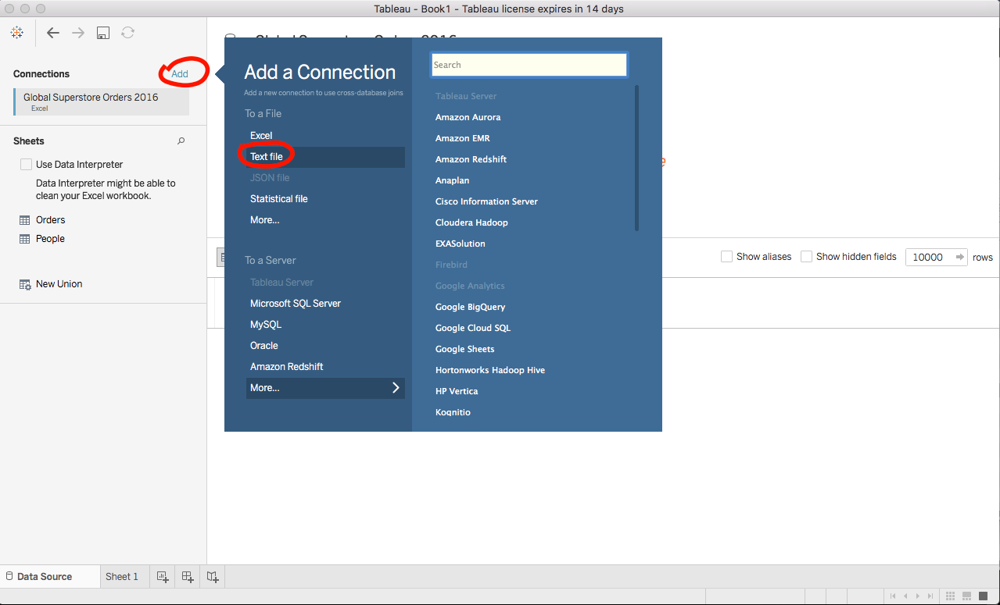
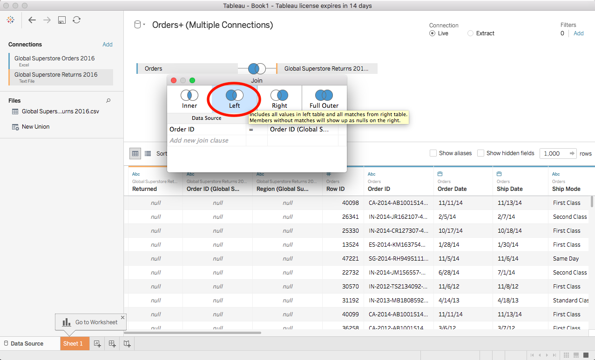
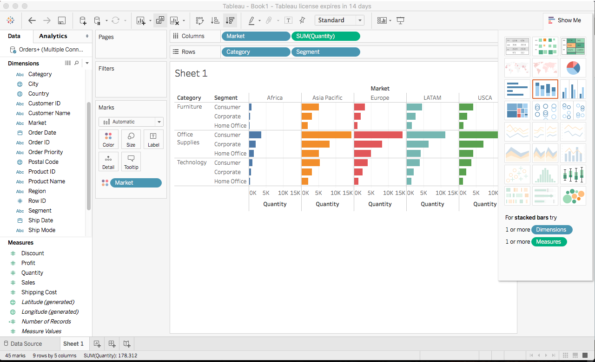
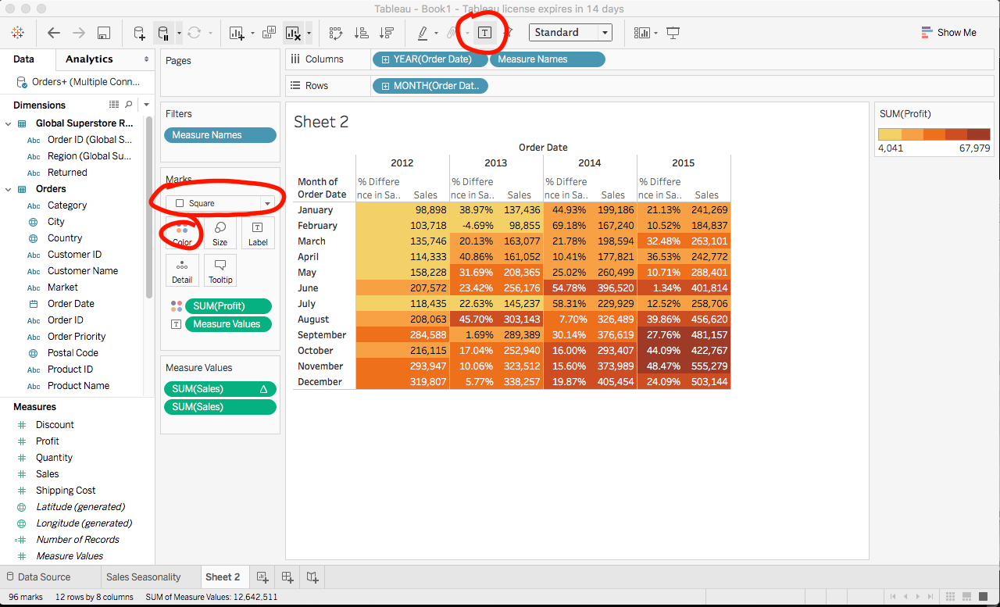
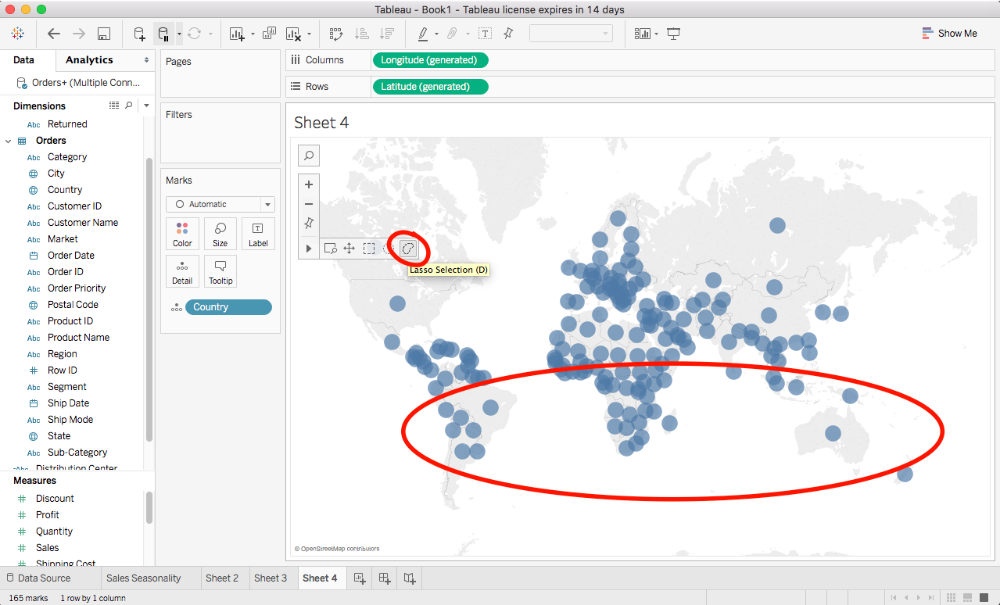
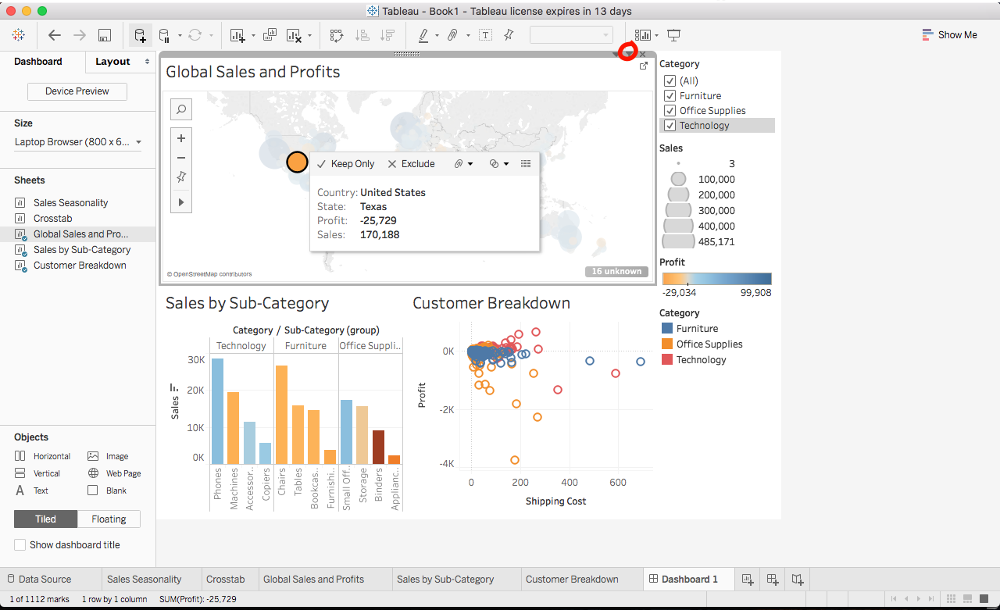

Download free 14 Day Trial Here
https://www.tableau.com/products/desktop/download

Download Example Dataset
https://www.tableau.com/sites/default/files/getting_started_data_sets.zip

Connect to a File
Select Excel under Connect > To a File and select ‘Global Superstore Orders 2016.xlsx’

There are two sheets in the excel file, Orders and People. Drag orders to where it says ‘Drag sheets here’.

Add another connection. This time select Text file and select ‘Global Superstore Returns 2016.csv’.

 It automatically adds the sheet and does a default cross database join. Click on the join symbol to see its details. To see all the information in Orders and the return information for transactions that were returned, select a Left Join. Leave Order ID as the join clause.

Manipulating the Fields
Click on the dropdown menu of the Order ID column and select Custom Split.
Type ‘-’ as the separator and select OK. We can see a new column is added. Go to its dropdown menu and rename it to Distribution Center

Now that we’ve set up our data source, select the Sheet 1 tab near the bottom left corner.

Visualization
Let’s analyze the sales per Category, Customer Segment, and Market based on the number of items sold.
Drag Category and Segment to Rows, and Quantity and Market to Columns. Also drag Market to Color.

The result should look like:

Drilling Down
First clear the sheet by selecting the shortcut in the tool bar.
Drag Sales to Rows and Order Date to Columns. We now see sales increase over the four years there is data for. 
Click the ‘+’ symbol next to YEAR(Order Date) to drill down to the Quarters in each year. Flip Quarter and Year to view the data in quarters over years instead.
Drag Years to Color to see all the lines for each year on the same graph.
We can easily change the scope at which data is aggregated. Select the drop down menu for Quarters and select Month.
We can also change the measure of Sales. It is currently SUM but we could change it to another measure such as average or median.

Year over Year Growth
Select Quick Table Calculation>Year Over Year Growth in the drop down menu for Sales.

Add Sales to Rows and move the Year over Year Growth one to Tooltip. Now when we hover over the lines we can see the Year over Year Growth information.

We see a consistent dip in sales in July. By right clicking the graph, and selecting Annotate>Point we can leave an annotation on the graph. This image could easily be shared by right clicking the graph and selecting Copy>Image.
Double click the sheet tab and rename it Sales Seasonality.

To see the data behind the graph, we can select Copy>Data and paste it into Excel. Or, right click the sheet tab in the lower right corner and select Duplicate as Crosstab

Swap the rows and columns so we can see our data better.
To visualize how profits are drag Profit to Color. If the colors make it difficult to interpret, click Color and select Edit Colors. You can change the color scheme and check Stepped Color. Also, change the Mark Type to Square and turn on Mark Labels.

Add Category to Rows. Then under Category’s drop down menu select Show Highlighter. Using the highlighter we can easily differentiate between the different categories. We see that Furniture does not have as good of profits near the end of the year. Rename this sheet to Crosstab.

Let’s create a new sheet to investigate this further.

Show Me
Does furnitures profits vary regionally? How to best view the data?
Know the data we want to look at, but don't an effective way to visualize it.
Select Country and Sales while holding command (or possible ctrl). The appropriate visualizations will light up in the Show Me menu. Select the symbol map and add State to the visual. Also add Profit to Color. You can increase or decrease the size of the circles and make them transparent. Rename the sheet to Global Sales and Profit.

Duplicate the sheet and get rid of everything except Country. Then use the lasso selection tool to select the dots in the southern hemisphere and click create group. It is now a new field under dimensions called Country (group). We can now go back to our Sales Seasonality Sheet and add the new field to Columns.

Delete the new sheet where we created the group and go back to Global Sales and Profit. Drag Category to the Filters area and select Furniture. Right click the filter and select Show Filter to make it interactive. 

Make a new sheet and select Category, Sub-Category, and Sales. Select the horizontal bar chart that Show Me recommends.
Create a hierarchy by dragging Sub-Category onto Category under the dimensions menu. Call the hierarchy Products. Also drag Product Name into the hierarchy. You can now drill down by clicking the + or - signs in the Rows section. Sort the Categories using the tool in the tool bar. We can also click the icon next to the Sales label on the x-axis. Now add Profit to Color. We can quickly see that Tables' profits are very bad enough though the sales are good.

Drag Market to Columns and we can see that this trend of Tables having poor profits is happening everywhere.
Select all the sub-categories Art through Labels and right click and select Group. Right click the new group and rename it by selecting edit alias.

Get rid of market and swap the rows and columns. Rename it Sales by Sub-Category and create a new sheet.

Add Profit to Rows and Shipping Cost to Columns and Category to Color. Add Customer ID to details to see a mark for each customer for each category. Select Analysis in the menu and uncheck Aggregate Measures to disaggregate our data to see every transaction.

Switch from the Data tab to Analytics and drag Trend Line to the Sheet and pick Linear Trend Line. It doesn't appear to give any meaningful insight so drag them off.

Drag a rectangle around some of the points with low profit and select View Data.
Rename the sheet to Customer Breakdown.

Click the New Dashboard Tab to create one.
Drag Global Sales and Profits onto the dashboard and place Sales by Sub-Category and Customer Breakdown below it.
Turn on Show dashboard title in the lower left corner.

To make all the visualization change based on the Category filter, select Apply to Worksheets>All Using this Data Source from the filters drop down menu.

We can drill down further be selecting a piece of data and clicking the filter icon in the upper right corner of that visual. Select the unprofitable circle in Texas and press the filter icon.

Stories
Click the New Story tab. Drag Global Sales and Profits onto the sheet and add the caption "Profits look strong".
Click New Blank Point and add the Dashboard to the sheet.

